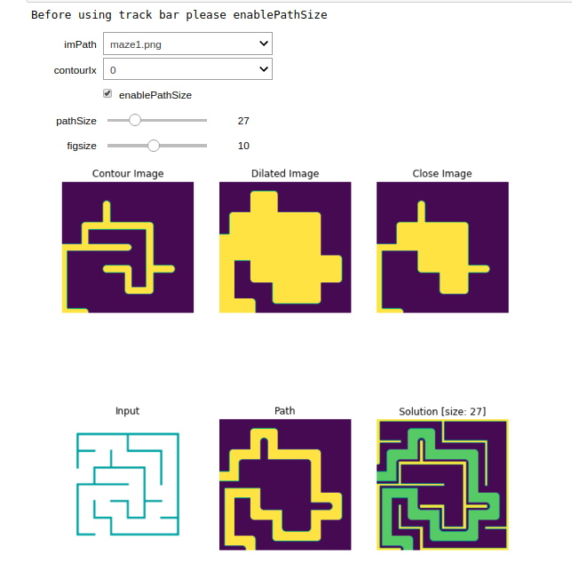

# solve maze
A simple image processing approach to solve maze using morphological operations

reference: [Guide to Signals and Patterns in Image Processing](https://link.springer.com/book/10.1007/978-3-319-14172-5)

run live colab [demo](https://colab.research.google.com/github/vishnu89chand/python_solve_maze/blob/master/python_solve_maze.ipynb)

Hints:
*   A maze consists of walls (255) and paths (0)
*   Where the correct path split the maze into two parts.
* Dead ends are basically paths (0) surrounded by wall (255) can be detected using closing operations

Algorithm:
1. Select any one contour and choose a ksize (for good result choose kernel size == pathSize).
2. Dilate the contour. This will generate a mask with all possible paths
3. Perform closing opertion on the image. This mask shows all the dead ends
4. Now find the final path by removing dead ends from the all possible paths.

